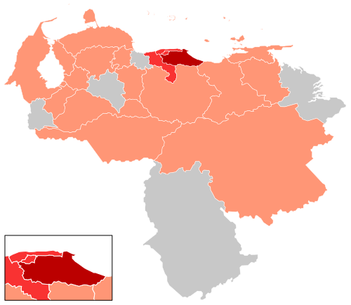

```{r setup, include=FALSE}
library(flexdashboard)
library(plotly)
library(wordcloud)
library(dplyr)
Cases<-read.csv('./Cases.csv')[,-1]
Cases_States<-read.csv('./Cases_States.csv', encoding = "UTF-8")[,-1]
Status<-read.csv('./Status.csv')[,-1]
Cases$Dates<-as.POSIXct(Cases$Dates,format="%d-%m-%Y")
```

Venezuela
=======================================================================

Column {data-width=350}
-----------------------------------------------------------------------

### confirmed {.value-box}
 
```{r}

valueBox(value = paste(Status[1,2]), 
         caption = "Total Confirmed Cases", 
         icon = 'fas fa-stethoscope', 
         color = 'Purple')
```


### active {.value-box}

```{r}
valueBox(value = paste(Status[2,2]), 
         caption = "Active Cases", icon = "fas fa-medkit", 
         color = 'Orange')
```

### recovered {.value-box}

```{r}
valueBox(value = paste(Status[4,2]), 
         caption = "Recovered Cases", icon = 'ion-android-favorite-outline', 
         color = '#00FFFF')
```

### death {.value-box}

```{r}

valueBox(value = paste(Status[3,2]),
         caption = "Death Cases", 
         icon = "fas fa-heartbeat", 
         color = 'red')
```

Column {data-width=650}
-----------------------------------------------------------------------

### Evolution per day

```{r}
plot_ly(data=Cases,
        x=~Dates,
        y=~CasesPerDay,
        mode='lines+markers',
        type='scatter',
        marker=list(color='black',size=10),
        line=list(color='black'))
```

### Total Cases per day

```{r}
plot_ly(data=Cases,
        x=~Dates,
        y=~AcumulativeSum,
        type='bar',
        text=~AcumulativeSum,
        name='Active',
        marker=list(color='#FFA500'),
        textposition='auto')
```

States {data-orientation=rows}
=======================================================================

row {.tabset}
-----------------------------------------------------------------------

### States

```{r}
Cases_States$state <- factor(Cases_States$state, levels = unique(Cases_States$state)[order(Cases_States$CasesPerState, decreasing = TRUE)])

plot_ly(data=Cases_States,
        x=~state,
        y=~CasesPerState,
        type='bar',
        text=~CasesPerState,
        marker=list(color='purple'),
        textposition='auto')
```

### Map

```{r}


  
```


### Wordcloud

```{r}
df <- Cases_States %>% mutate(CasesPerState=CasesPerState*100)

set.seed(1234)
wordcloud(words = df$state, 
          freq = df$CasesPerState, 
          random.order=FALSE, 
          rot.per=0.35,
          colors=brewer.pal(8,"Dark2"))
```


Data
=======================================================================

**Data**

For the data, I did web scrapping to the page of wikipedia about the COVID-19 in Venezuela, see page [here](https://es.wikipedia.org/wiki/Pandemia_de_enfermedad_por_coronavirus_de_2020_en_Venezuela) and to see the script, visit the [repository](https://github.com/ja-castillo25/CoronavirusVnzla), also you can see data of all the countries in [here](https://github.com/RamiKrispin/coronavirus)

**Deployment and Reproducibly**
  
  The dashboard was deployed to Github docs. If you wish to deploy and/or modify the dashboard on your Github account, you can apply the following steps:
  
* Fork the dashboard [repository](https://github.com/RamiKrispin/coronavirus_dashboard), or
* Clone it and push it to your Github package
* Here some general guidance about deployment of flexdashboard on Github page - [link](https://github.com/pbatey/flexdashboard-example)

**About me**

I'm José Castillo, a data scientist from Venezuela, and I wanted to do some data visualization about the coronavirus in Venezuela, I get inspired from a dashboard developed by [Rami Krispin](https://ramikrispin.github.io/). You can contact me on [Linkedin](https://www.linkedin.com/in/ja-castillo25) or you can visit my [page](https://ja-castillo25.github.io/) if you have a question!
